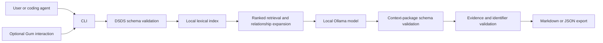

# Product Requirements Document: DSDS Local Context CLI

**Status:** First draft for review  
**Working name:** TBD  
**Owners:** Davy Fung and PJ  
**Delivery capacity:** Up to 6 human hours per week, with Codex as pair programmer  
**Target:** Working MVP demonstration after approximately 3 weeks / 18 human hours

## 1. Executive Summary

### Problem Statement

Designers prototyping in code and frontend developers building product experiences must translate design intent into implementation decisions, but design-system guidance is fragmented, difficult for coding agents to consume, and often unavailable to local workflows. DSDS makes that guidance machine-readable, but it does not yet provide a simple offline workflow that turns a product task into a compact, grounded context package for the next coding agent.

### Proposed Solution

Build an open-source, local-first CLI that reads DSDS documents, retrieves the entities and document blocks relevant to a product task, uses a small model through Ollama to synthesize the evidence, and exports a structured context package for a coding agent. Gum will provide an optional interactive terminal experience, while a stable non-interactive command and JSON output will support automation.

The MVP supplies guidance and implementation constraints; it does not require or generate a component library.

### Success Criteria

- On a benchmark of at least 50 representative design-system questions, the CLI returns a correct, grounded answer for at least 80% of all questions.
- For every benchmark question the DSDS corpus cannot support, the CLI returns an explicit insufficient-evidence result rather than inventing an entity, token, component, or rule.
- Every substantive recommendation contains at least one valid DSDS entity identifier and supporting document-block reference; citation validity must be 100% in the benchmark.
- The complete indexing, retrieval, inference, and export flow runs offline after installation and model download, with no design-system content transmitted to a remote service.
- A new user can produce their first context package within 10 minutes after satisfying the documented prerequisites.

## 2. User Experience & Functionality

### User Personas

**Primary persona — Designer prototyping in code**

A product or systems designer who uses a coding agent to prototype experiences and wants the prototype to follow an established design system without repeatedly locating and pasting documentation.

**Secondary persona — Product frontend developer**

A developer implementing a product task who needs authoritative components, patterns, tokens, accessibility guidance, content guidance, and constraints before asking a coding agent to write code.

**Supporting persona — Design-system maintainer**

A maintainer who wants to verify that DSDS documentation is useful to downstream agents and identify when the documentation cannot support a requested task.

### User Flow

1. The user points the CLI at a local DSDS file or directory.
2. The CLI validates the documents and builds or refreshes a local lexical index.
3. The user describes the task interactively through Gum or passes it directly as a command argument.
4. Deterministic retrieval selects relevant entities, document blocks, metadata, and relationships.
5. The local model synthesizes only the retrieved evidence into the context-package schema.
6. The CLI validates every cited identifier against the source corpus.
7. The user previews the package and writes it as Markdown or JSON for the next coding agent.
8. If the evidence is insufficient, the package identifies the missing guidance instead of fabricating an answer.

### User Stories and Acceptance Criteria

#### Story 1: Generate an agent context package

As a designer prototyping in code, I want to describe a product task and receive a compact design-system context package so that my coding agent can implement the next step with appropriate guidance.

**Acceptance criteria**

- A command equivalent to `dsds-local context "Build a destructive account-deletion flow"` accepts a natural-language task.
- The output contains a task summary, recommendations, constraints, relevant entities, evidence references, uncertainties, and explicit missing guidance.
- The package can be written as Markdown for human/agent prompting or JSON for programmatic use.
- The package does not claim that implementation components exist unless the DSDS source explicitly documents them.
- Re-running the same command against unchanged inputs uses the same deterministic retrieval settings and produces materially consistent evidence.

#### Story 2: Use an approachable interactive CLI

As a user unfamiliar with CLI flags, I want guided prompts so that I can generate a context package without memorizing commands.

**Acceptance criteria**

- Running `dsds-local` without arguments starts a Gum-based flow.
- The flow lets the user select a DSDS source, enter a task, choose Markdown or JSON, preview the result, and select an output path.
- The CLI checks for Gum and provides an actionable installation message or falls back to the non-interactive usage documentation.
- All core behavior remains available without Gum through explicit flags.

#### Story 3: Receive honest insufficient-evidence results

As a product developer, I want the assistant to identify documentation gaps so that I do not implement fabricated design-system guidance.

**Acceptance criteria**

- The response schema distinguishes `supported`, `partially_supported`, and `insufficient_evidence` outcomes.
- An insufficient-evidence result states what was searched and which information is missing.
- The model cannot cite identifiers that are absent from the indexed corpus; post-generation validation rejects and retries or fails such output.
- No unsupported token value, component API, accessibility rule, or platform capability is presented as authoritative.

#### Story 4: Operate completely offline

As a user working with private design-system documentation, I want the workflow to stay on my machine so that proprietary guidance is not shared externally.

**Acceptance criteria**

- Runtime network access is not required after the CLI, dependencies, and model are installed.
- The default inference endpoint is a loopback Ollama endpoint.
- The MVP includes no telemetry, hosted analytics, cloud fallback, user accounts, or remote document storage.
- Documentation includes an offline verification procedure that runs the benchmark with network access disabled.

#### Story 5: Verify source quality before inference

As a design-system maintainer, I want invalid DSDS documents reported before they reach the model so that assistant failures are not confused with source-format errors.

**Acceptance criteria**

- The CLI validates inputs against the applicable bundled DSDS JSON Schema before indexing.
- Validation errors identify the source file and failing JSON path.
- Editorial lint findings may be shown as warnings but do not block context generation.
- The generated context package records the DSDS version and source files used.

### Non-Goals

The MVP will not:

- Generate production-ready UI code or create a new component library.
- Modify DSDS documents, automatically repair documentation, or apply patches.
- Fine-tune or train a model.
- Require embeddings, a vector database, an MCP server, or multiple inference providers.
- Review an entire application repository for design-system compliance.
- Provide a graphical desktop or web interface.
- Replace professional design, accessibility, security, or engineering review.
- Guarantee answers for information that the supplied DSDS corpus does not contain.

## 3. AI System Requirements

### Tool Requirements

- **DSDS loader:** Discover local `.json` and `.dsds.json` inputs, parse supported document shapes, and preserve source locations.
- **Schema validator:** Validate source documents against the DSDS bundled JSON Schema using AJV or the existing DSDS validation path.
- **Lexical retrieval:** Rank entities and blocks using deterministic keyword/BM25-style search, with filters for entity kind and platform.
- **Relationship expansion:** Add directly related entities within a fixed, configurable traversal depth.
- **Ollama adapter:** Send retrieved evidence and a constrained task prompt to a local Llama 3.2 3B Instruct baseline.
- **Structured-output validator:** Require a JSON response matching the context-package schema.
- **Evidence validator:** Confirm every citation, entity identifier, and block reference exists in the retrieved DSDS source.
- **Exporter:** Render validated output to machine-readable JSON and concise Markdown.
- **Gum adapter:** Provide optional prompts, selection, progress, preview, and confirmation without owning any business logic.

The model may synthesize and prioritize retrieved material, but deterministic code owns document validation, retrieval, citation verification, file discovery, and export.

### Evaluation Strategy

Create a version-controlled benchmark with at least 50 tasks divided across:

- Component or pattern selection.
- Token and foundation guidance.
- Accessibility and content requirements.
- Platform availability or status.
- Relationship and dependency questions.
- Deliberately unsupported requests.

Each benchmark record must include the task, expected answerability, acceptable entity identifiers, required evidence blocks, prohibited claims, and a reviewer-approved reference answer or abstention rationale.

Measure:

- **Grounded task success:** Percentage of all tasks receiving a correct, evidence-supported result; target `>= 80%`.
- **Unsupported-claim rate:** Percentage containing an invented or unsupported authoritative claim; target `0%`.
- **Citation validity:** Percentage of citations resolving to the supplied corpus; target `100%`.
- **Abstention correctness:** Percentage of unsupported tasks correctly returning `insufficient_evidence`; target `100%` for the MVP benchmark.
- **Schema validity:** Percentage of model responses passing the context-package schema after allowed retries; target `>= 98%`.
- **Latency:** P95 time from submission to validated package `<= 15 seconds` on an agreed reference computer; reference hardware is `TBD` before benchmark sign-off.

Compare the MVP against a deterministic retrieval-only baseline. Fine-tuning is considered only after error analysis shows repeated behavioral failures that retrieval, prompts, or validation cannot address.

## 4. Technical Specifications

### Architecture Overview



**Proposed implementation stack**

- Node.js and TypeScript, subject to confirmation during the integration spike, because the DSDS project already uses Node-based validation, linting, and build scripts.
- AJV for JSON Schema validation.
- A lightweight in-process lexical index for the MVP; SQLite FTS may replace it only if corpus size or persistence requires it.
- Ollama as the only initial inference provider.
- Llama 3.2 3B Instruct as the baseline model; the model identifier remains configurable.
- Gum as an optional executable dependency for interactive presentation.

**Context-package contract**

The JSON output must include at minimum:

```json
{
  "schemaVersion": "1",
  "status": "supported | partially_supported | insufficient_evidence",
  "task": "User-supplied task",
  "summary": "Short interpretation of the task",
  "recommendations": [],
  "constraints": [],
  "evidence": [
    {
      "entityIdentifier": "example-identifier",
      "entityKind": "component",
      "blockKind": "guidelines",
      "source": "path/to/source.dsds.json"
    }
  ],
  "uncertainties": [],
  "missingGuidance": []
}
```

The schema should remain deliberately smaller than the full DSDS schema and should be versioned independently.

### Integration Points

- **DSDS documents:** Input source of truth. DSDS currently defines structured documentation for components, tokens, token groups, themes, foundations, patterns, guides, and chunks, along with typed document blocks and relationships.
- **DSDS validation and lint:** Reuse the bundled schema and compatible validation behavior. Editorial lint is informative and remains non-blocking.
- **Ollama local API:** Local structured inference over retrieved evidence.
- **Filesystem:** Read DSDS sources and write user-approved Markdown or JSON packages. The MVP does not modify source documents.
- **Shell:** Invoke Gum for interactive presentation when installed.
- **Coding agents:** Consume the exported package through pasted Markdown, an explicitly referenced file, or JSON piped to a later command. Direct vendor-specific agent integration is deferred.

The non-interactive interface should follow standard CLI conventions:

```text
dsds-local context "<task>" --source <path> --format json|markdown --output <path>
dsds-local validate --source <path>
dsds-local benchmark --dataset <path>
```

Successful JSON output goes to stdout when `--output` is omitted; diagnostics go to stderr; exit codes must be documented and stable.

### Security & Privacy

- Process documentation and prompts locally by default and provide no cloud fallback.
- Permit only loopback inference endpoints in the MVP unless the user explicitly changes configuration.
- Collect no telemetry or prompt logs outside user-selected local files.
- Treat DSDS prose as untrusted data, not executable instructions; prompts must delimit retrieved content and ignore instructions embedded within it.
- Do not execute commands, imports, code samples, or links found in DSDS documents.
- Read source documents without mutation and require explicit confirmation before overwriting any exported context package.
- Record source paths and DSDS version for auditability, without copying unnecessary corpus content into benchmark or log files.

## 5. Risks & Roadmap

### Phased Rollout

#### MVP — Three-week working demonstration

**Capacity:** Approximately 18 human hours total, supplemented by Codex implementation and testing.

- Implement DSDS file discovery, validation, entity extraction, and lexical retrieval.
- Define the versioned context-package JSON Schema.
- Integrate Ollama and Llama 3.2 3B with constrained output.
- Validate evidence and identifiers after generation.
- Implement `context`, `validate`, and a minimal `benchmark` command.
- Add the Gum-guided flow as a presentation layer.
- Create the first 20 benchmark cases, expanding to 50 during v1.1.
- Demonstrate Markdown and JSON packages using validated DSDS examples; a real component package is not required.

#### v1.1 — Reliability and open-source readiness

- Expand and independently review the benchmark to at least 50 cases.
- Add relationship expansion, caching, clearer diagnostics, and documented exit codes.
- Test on macOS and Linux with representative hardware.
- Add installation documentation, offline verification, contribution guidance, and an example agent handoff.
- Compare Llama 3.2 3B with a larger untuned local baseline if hardware permits.

#### v2.0 — Evidence-driven expansion

Only pursue features supported by MVP usage and evaluation data:

- Additional OpenAI-compatible local inference endpoints or llama.cpp.
- MCP or direct coding-agent integration.
- Documentation-gap explanations and draft-only DSDS patches.
- Source adapters for Storybook, Custom Elements Manifest, or other licensed design-system documentation.
- Fine-tuning through LoRA/QLoRA if benchmark error analysis demonstrates a durable advantage over retrieval and prompting improvements.

### Technical Risks

- **Insufficient real corpus:** DSDS examples may not represent the ambiguity of a production design system. Mitigation: design the benchmark so a real DSDS corpus can be added later without changing the output contract.
- **Small-model reasoning quality:** A 3B model may choose superficially related guidance. Mitigation: deterministic retrieval, small evidence windows, schema-constrained output, citation validation, and explicit abstention.
- **False confidence despite valid JSON:** Structural validity does not guarantee factual support. Mitigation: validate every cited identifier and require benchmark review of the claim-to-evidence relationship.
- **Evolving DSDS specification:** DSDS is pre-1.0 and may introduce breaking changes. Mitigation: record the DSDS version, fail clearly on unsupported versions, and isolate parsing behind a compatibility layer.
- **Local hardware variance:** Latency and model availability will differ across machines. Mitigation: define reference hardware, expose the model identifier, measure latency separately from correctness, and document minimum memory requirements after testing.
- **Gum packaging dependency:** Requiring a separate executable can complicate onboarding and automation. Mitigation: keep Gum optional and ensure every workflow has a non-interactive equivalent.
- **Side-project capacity:** A six-hour weekly cap makes broad feature expansion the largest schedule risk. Mitigation: freeze MVP non-goals, reserve human time for product decisions and expert review, and let Codex handle implementation, test scaffolding, and documentation drafts.
- **Context package ignored by agents:** Correct guidance may not affect generated code. Mitigation: evaluate package usefulness with small agent handoff trials in v1.1 and revise the package structure before adding integrations.

